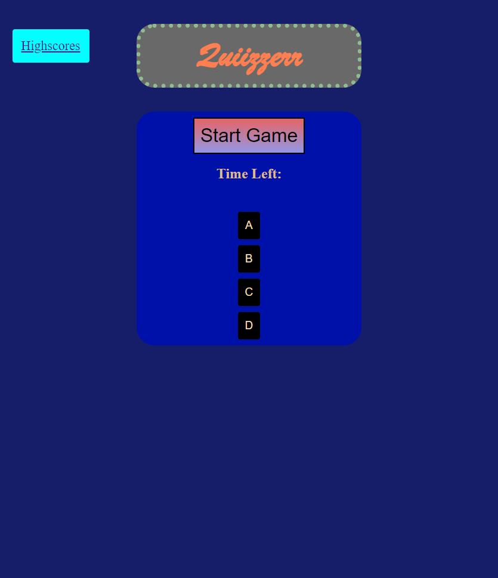

# Quiizzerr

### Description:
This is a quizing website that takes in account time with a multiple choice quiz. For every question you get wrong you loose ten seconds on the clock. Your Highscore will get updated to the highscore page every time you save your highscore.

### To do list:
1\. Add imgs or gifs for more eyecandy.  
2\. Add more CSS to make more visually pleasing

### Technology used:
1\. HTML  
2\. CSS     
3\. Javascript

## Links:

[Link to Github Repo](https://github.com/Lekashi/Quiizzerr "Link to Github Repo")

[Link to Website](https://lekashi.github.io/Quiizzerr/ "Link to Website")

## Screenshot of the website

